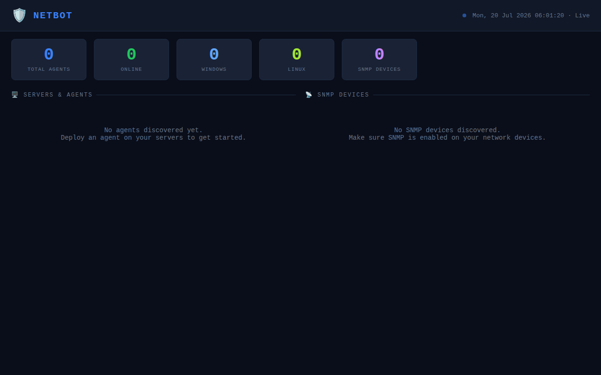

# 🔧 TeleOps

### Unified Network Operations Center — Telegram bot, SNMP discovery, and a live observability dashboard for your infrastructure

TeleOps (formerly "J1 NOC Nexus" / **NetBot**) is a Python ops platform that ties together a Telegram command bot, automated network/SNMP discovery, cross-platform agents, and a real-time web dashboard. Point it at your network ranges, drop the agent on your hosts, and get a single ops-grade view of what is online, what is degraded, and what needs attention.

[](LICENSE)
[](https://www.python.org)
[](docker-compose.yml)



## ✨ Features

- **Telegram Bot** — `/status`, `/agents`, `/snmp`, `/dashboard`, `/alert` and more, driven by `python-telegram-bot`.
- **Live Dashboard** — Flask + SocketIO web UI showing agents and SNMP devices in real time.
- **SNMP Discovery** — Scheduled SNMP polling (`pysnmp`) across communities/versions you configure.
- **Network Discovery** — Async ping sweeps of your configured CIDRs.
- **Agent Server** — aiohttp registration + installer download endpoints so Linux/Windows hosts can self-onboard.
- **Cross-Platform Agents** — bootstrap scripts for Linux (`agents/linux`) and Windows (`agents/windows`).
- **Demo mode** — runs the dashboard + agent server with **no Telegram token**, so you can inspect the stack immediately.

## 🚀 Quick Start

### Docker (recommended)

```bash
git clone https://github.com/OneByJorah/TeleOps.git
cd TeleOps
docker compose up -d --build
# Open http://localhost:5000  (dashboard)  ·  http://localhost:8080/health (agent server)
```

The container auto-generates `.env` secrets on first run and copies `config/config.yaml.example`
to `config/config.yaml`. Without a Telegram token the bot is skipped and the dashboard still runs.

### Manual / from source

```bash
git clone https://github.com/OneByJorah/TeleOps.git
cd TeleOps
python3 -m venv .venv && source .venv/bin/activate
pip install -r requirements.txt          # note: nmap/python-nmap/scapy/pywinrm are dropped on Linux
cp config/config.yaml.example config/config.yaml
# (optional) set bot.token in config/config.yaml to enable the Telegram bot
python3 run.py                            # dashboard on :5000, agent server on :8080
```

> ⚠️ `nmap==0.0.1` and `python-nmap` are not installable from PyPI; the Dockerfile and the
> local install strip them. `scapy`/`pywinrm` are stripped from the Linux install (Windows-only / optional).

## 📸 Screenshots

- `docs/screenshots/main-dashboard.png` — TeleOps live web dashboard (empty-state).
- `docs/screenshots/api-summary.png` — `/api/summary` JSON endpoint.
- `docs/screenshots/api-agents.png` — `/api/agents` JSON endpoint.

## 🏗️ Architecture / How It Works

```
Telegram ──► bot/main.py (python-telegram-bot, optional)
                │  starts
                ├─► discovery/network_scanner.py   (ping sweeps)
                ├─► discovery/snmp_scanner.py      (SNMP polls)
                └─► bot/scheduler.py               (heartbeats / alerts)

run.py (single entrypoint)
   ├─► dashboard/app.py      Flask + SocketIO  :5000
   └─► bot/agent_server.py   aiohttp           :8080   (/agent/register, /health, installers)
```

`run.py` is the container entrypoint. It always starts the dashboard and the agent server.
The Telegram bot only starts when a real token is present (config or `TELEGRAM_BOT_TOKEN`),
so the stack boots cleanly for demos and local inspection.

## ⚙️ Configuration

Copy `config/config.yaml.example` → `config/config.yaml`. Key sections:

| Key | Purpose |
|-----|---------|
| `bot.token` | Telegram bot token. Leave as `YOUR_TELEGRAM_BOT_TOKEN` to disable the bot. |
| `bot.admin_ids` | Telegram user IDs allowed to control the bot. |
| `server.port` | Agent registration server port (default `8080`). |
| `dashboard.port` | Web dashboard port (default `5000`). |
| `discovery.networks` | CIDR ranges to ping-scan. |
| `snmp.communities` | SNMP community strings to poll. |
| `alerts.thresholds` | CPU / memory / disk alert thresholds. |

A `.env` file (from `.env.example`) is also read by the container for `TELEGRAM_BOT_TOKEN`,
`REDIS_*` and `SECRET_KEY`. Redis is optional for the demo/dashboard path.

## 🧪 Testing

```bash
source .venv/bin/activate
pip install pytest pytest-asyncio
pytest tests/ -v --tb=short
```

## 🗺️ Roadmap

Infrastructure hardening, broader device vendor support, and richer dashboard widgets.
See `ROADMAP.md` for the current outline.

## 🤝 Contributing

PRs welcome. Run `pytest` and keep `flake8` clean (`--max-line-length=120`).
See `CONTRIBUTING.md` and `CODE_OF_CONDUCT.md`.

## 📄 License

MIT — see [LICENSE](LICENSE).

## 👤 Author

Built by **Jhonattan L. Jimenez** ([@OneByJorah](https://github.com/OneByJorah)) under **JorahOne LLC**.
More projects: [github.com/OneByJorah](https://github.com/OneByJorah)
