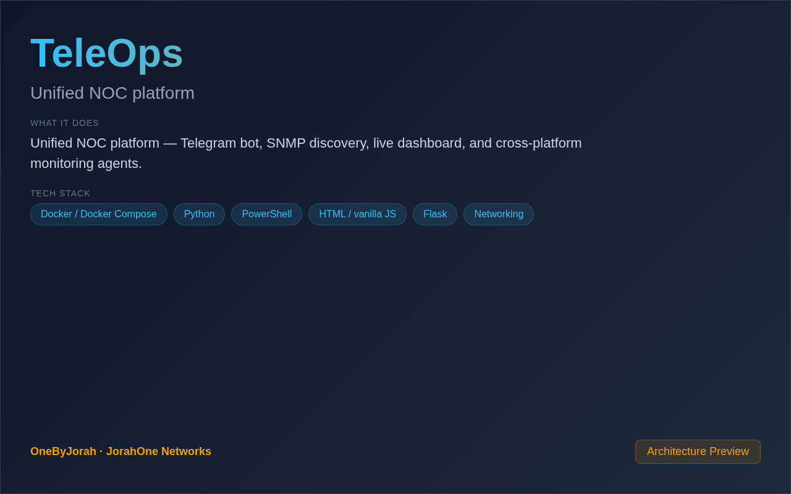

<div align="center">


# TeleOps

Unified NOC platform


</div>

---

<p align="center">
  
</p>

<br>

---

## Features

- **Telegram Bot** — Manage infrastructure via Telegram commands and alerts.
- **SNMP Discovery** — Automated network device discovery and inventory.
- **Live Dashboard** — Real-time monitoring with WebSocket updates.
- **Cross-Platform Agents** — Deploy monitoring agents across your infrastructure.
- **Alert Management** — Configurable alerts with escalation policies.
- **Flask + SocketIO** — Async real-time backend with event-driven updates.
- **Docker Compose** — One-command production deployment.

## Quick Start

```bash
git clone https://github.com/OneByJorah/TeleOps.git
cd TeleOps

cp .env.example .env  # Configure Telegram bot token
docker compose up -d
```

Open **http://localhost:5000** in your browser.

### Telegram Bot Setup

1. Create a bot via [@BotFather](https://t.me/BotFather)
2. Add the bot token to `.env`:
   ```
   TELEGRAM_BOT_TOKEN=your_token_here
   ```
3. Start the bot and send `/start`

## Environment Variables

| Variable | Default | Description |
|----------|---------|-------------|
| `FLASK_APP` | `app.py` | Flask application entry point |
| `SECRET_KEY` | *(empty)* | Flask secret key |
| `TELEGRAM_BOT_TOKEN` | *(empty)* | Telegram bot token from BotFather |
| `SNMP_COMMUNITY` | `public` | Default SNMP community string |
| `DATABASE_URL` | `sqlite:///teleops.db` | Database connection string |
| `ALERT_WEBHOOK` | — | Webhook URL for alert notifications |

## Architecture

```
Browser ──SocketIO──▶ Flask Backend ──▶ SQLAlchemy ──▶ SQLite
                          │
                          ├──▶ Telegram Bot API
                          ├──▶ SNMP Manager ──▶ Network Devices
                          ├──▶ Agent Registry
                          └──▶ Alert Engine
```

## Tech Stack

- **Backend**: Flask, Flask-SocketIO (Python 3.10+)
- **Frontend**: HTML/CSS/JS with SocketIO client
- **Bot**: Telegram Bot API integration
- **Network**: SNMP for device discovery and monitoring
- **Database**: SQLite (default), PostgreSQL (production)
- **Deployment**: Docker Compose, systemd

## Project Structure

```
TeleOps/
├── app.py                 # Flask application entry point
├── routes/
│   ├── dashboard.py       # Dashboard endpoints
│   ├── devices.py         # Device management
│   ├── alerts.py          # Alert handling
│   └── api.py             # REST API
├── services/
│   ├── telegram_bot.py    # Telegram bot integration
│   ├── snmp_manager.py    # SNMP discovery and polling
│   └── alert_engine.py    # Alert processing
├── templates/             # Jinja2 HTML templates
├── static/                # CSS, JS, images
├── agents/                # Cross-platform monitoring agents
├── docker-compose.yml     # Docker deployment
└── .env.example           # Configuration template
```

## Telegram Commands

| Command | Description |
|---------|-------------|
| `/start` | Initialize the bot |
| `/status` | Get system status |
| `/devices` | List discovered devices |
| `/alerts` | View active alerts |
| `/scan` | Trigger network discovery |
| `/help` | Show available commands |

## Contributing

Contributions are welcome. Please see [CONTRIBUTING.md](CONTRIBUTING.md) for guidelines and [CODE_OF_CONDUCT.md](CODE_OF_CONDUCT.md) for community standards.

## Security

For security concerns, see [SECURITY.md](SECURITY.md). Please report vulnerabilities to **info@jorahone.com** — do not use public issues.

## License

MIT © Jhonattan L. Jimenez

---

## 🤝 Contributing

See [CONTRIBUTING.md](CONTRIBUTING.md). All contributions follow the [Code of Conduct](CODE_OF_CONDUCT.md).

## 🔒 Security

Found a vulnerability? Please follow our [Security Policy](SECURITY.md) and report privately to `security@jorahone.com`.

## 📄 License

[MIT License](LICENSE) © Jhonattan L. Jimenez (OneByJorah)

---

<p align="center">Built with 🌴 by <a href="https://github.com/OneByJorah">OneByJorah</a> · <a href="https://jorahone.com">jorahone.com</a></p>
